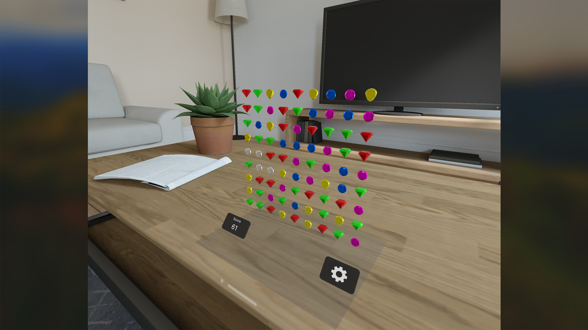

# Jewel Crack

Welcome to Jewel Crack, the ultimate relaxation game that combines classic match-three gameplay with innovative poke or gaze and pinch controls!

Immerse yourself in a world of sparkling gems and endless fun. Your objective is simple: match at least three gems of the same color to crack them and score points. But beware, the clock is ticking! The faster you crack the gems, the higher your score multiplier will soar. Challenge yourself to reach new heights of mastery and become the ultimate gem-crushing champion.

You have the option to interact with the gems in two distinct ways: either poke them with your fingertips for a tactile experience, or simply gaze at a gem and perform a pinch gesture to crack it. Choose the method that suits your mood and enjoy a seamless gaming experience.

But that's not all; This game is designed to fit effortlessly into your surroundings. Whether you're lounging on the couch, sipping coffee at a café, or soaking up the sun in the park, this game can be played anywhere you desire. With its soothing visuals and tranquil sounds, Jewel Crack is the perfect companion for those moments when you need to unwind and escape the stresses of everyday life.

## Key Features

- Classic match-three gameplay with a twist
- Intuitive touch and gaze controls for a unique gaming experience
- Score multiplier boosts for fast-paced gem-cracking action
- Relaxing visuals and atmospheric soundtrack
- Play anywhere, anytime, and let the stress melt away

<h2>Video</h2>
    

## Screenshots

